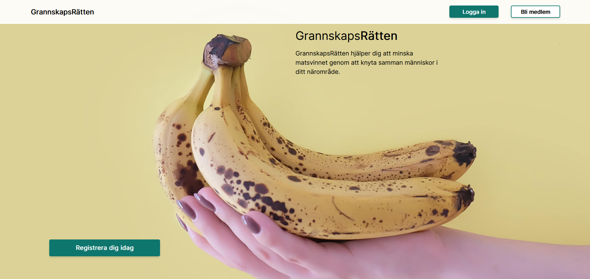

[](https://classroom.github.com/a/CViV37hj)


## Installationsanvisningar:

1. När projektet tagits ner från GitHub, kör `npm install` i både `front`-mappen och `back`- mappen för att installera dev-dependencies.

2.  För att köra igång backend-servern kan man antingen köra igång en mongoDB docker-instans med kommandot: `docker run -it -v mongodata:/data/db -p 27017:27017 --name mongodb --restart unless-stopped -d mongo:3` samt ansluta sin mongoDB-compass med URI: `mongodb://localhost:27017`.
Alternativt kan man ansluta sig med MongoDB atlas via MongoDB-compass för att få tillgång till databasen. Kopiera då din "connection-string" och klistra in i MongoDB-compass. Strängen brukar se ut som följande:
`mongodb+srv://<username>:<password>@cluster0.nikjolr.mongodb.net`


3. Kör `npm run dev` i både `front`-mappen och `back`-mappen för att köra igång servrarna.


4. Frontenden kan nu ses på `http://127.0.0.1:5173/` och kan köras mot backenden!


## Svar på frågan: vilket problem löser den här kodbasen?:
Genom vår applikation bidrar vi till att minska matsvinnet i hushållen. Att människor lätt kan skänka eller sälja överbliven mat som fortfarande ätbar gör att matsvinnet minskar och att förhoppningsvis öka medvetenheten om detta.

## Litet exempel på användning:




## Länkar till eventuell övrig dokumentation/referensmaterial:

- Figma: https://www.figma.com/file/KVjQYYut8XvH7VX2GhImoB/Low-fid?type=design&node-id=0-1&t=4i2cs8pdgEnpWtMF-0
- Mötesanteckningar: https://docs.google.com/document/d/1v7KzY8EejPQByMghWUuXI7Ng-7ncO_44W4VyskQgK_E/edit
- Budget:

```
Utgifter:

Löner:
2.5 m / per år (500k/person per år)

Kontor: 5k hyra/månaden
60 k/år

Engångskostnad:
Dator: 10k/person (60k totalt)
Arbetstelefon/abonemang: 700kr/månad/person

Uppstart av AB: 25k

Förbrukningsinventarier:
5k/år
Utgifter totalt: 2,7 m/år

Övriga skatter:
20.6% på vinst

Annonser:
Google:
600k visningar/dag/10k kr/dag = 300k/mån = 3,6m/år
10%/annons (annonsavgift)
40%/annonser gratis
Medelpris 35kr/annons
60% av annonser = 10% annonsavgift
100 000 prenumeranter
25% säljare
25 000 användare/dag = 60%
6250 använder säljare/dag 10%i vinst

Medelpris 35kr/måltid = 3,5kr i vinst/säljare (som ej är gratis)
625% 3,5kr = 21 875kr/mån = 262 500kr/år vinst från säljarna

Marknadsföring: 25k/mån = 300k/år

Inkomst: 3 862 600kr/år

Utgifter: 2,8m/år

Skatt: 20,6%

Inkomst - utgifter - mark= 3 862 600kr - 2 800 000 - 300 000 kr = 762 600kr

Skatt: 158k

Vinst: 604 600kr/ år 1
```


## Vilka som bidragit till projektet:

Cattis (Scrum Master), 
Saliem,
Viktoria,
Bager,
William,
Lukas.

## Licens

**MIT License** 

Copyright (c) 2023 Grannskapsrätten

Permission is hereby granted, free of charge, to any person obtaining a copy
of this software and associated documentation files (the "Software"), to deal
in the Software without restriction, including without limitation the rights
to use, copy, modify, merge, publish, distribute, sublicense, and/or sell
copies of the Software, and to permit persons to whom the Software is
furnished to do so, subject to the following conditions:

The above copyright notice and this permission notice shall be included in all
copies or substantial portions of the Software.

THE SOFTWARE IS PROVIDED "AS IS", WITHOUT WARRANTY OF ANY KIND, EXPRESS OR
IMPLIED, INCLUDING BUT NOT LIMITED TO THE WARRANTIES OF MERCHANTABILITY,
FITNESS FOR A PARTICULAR PURPOSE AND NONINFRINGEMENT. IN NO EVENT SHALL THE
AUTHORS OR COPYRIGHT HOLDERS BE LIABLE FOR ANY CLAIM, DAMAGES OR OTHER
LIABILITY, WHETHER IN AN ACTION OF CONTRACT, TORT OR OTHERWISE, ARISING FROM,
OUT OF OR IN CONNECTION WITH THE SOFTWARE OR THE USE OR OTHER DEALINGS IN THE
SOFTWARE.